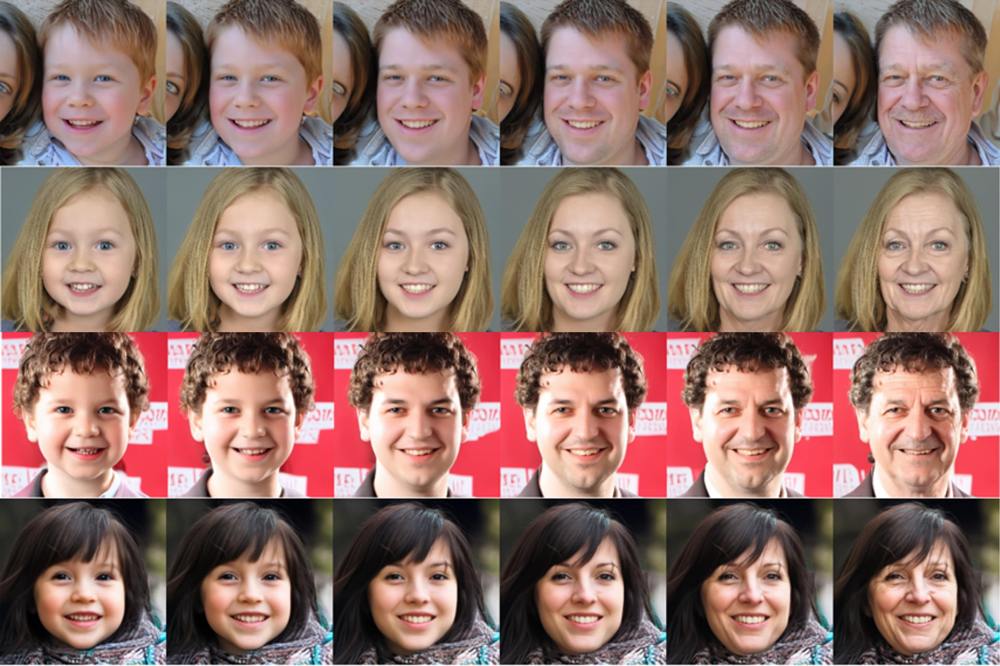

# PADA: Pluralistic Aging Diffusion Autoencoder (ICCV 2023)

## Code is comming soon!
> Face aging is an ill-posed problem because multiple plausible aging patterns may correspond to a given input. Most existing methods often produce one deterministic estimation. This paper proposes a novel CLIP-driven Pluralistic Aging Diffusion Autoencoder (PADA) to enhance the diversity of aging patterns. First, we employ diffusion models to generate diverse low-level aging details via a sequential denoising reverse process. Second, we present Probabilistic Aging Embedding (PAE) to capture diverse high-level aging patterns, which represents age information as probabilistic distributions in the common CLIP latent space. A text-guided KL-divergence loss is designed to guide this learning. Our method can achieve pluralistic face aging conditioned on open-world aging texts and arbitrary unseen face images. Qualitative and quantitative experiments demonstrate that our method can generate more diverse and high-quality plausible aging results.

<a href="https://arxiv.org/abs/2303.11086"></a>
<a href="https://opensource.org/licenses/MIT"></a>


## Description
Official Implementation of our Pluralistic Aging Diffusion Autoencoder (PADA) paper for both training and evaluation. PADA allows modeling flexible and diverse face aging conditioned on texts and images.




## TODO
- [ ] Release the pretrained model and inference code.
- [ ] Release the training code.
- [ ] Add jupyter notebooks demo.

## Acknowledgments
Our code borrows from [SAM](https://github.com/yuval-alaluf/SAM) and [DiffAE](https://github.com/phizaz/diffae). We would like to express our gratitude for their generosity in sharing their work.

## Citations
If you use this code for your research, please cite our paper [Pluralistic Aging Diffusion Autoencoder](https://arxiv.org/abs/2303.11086):
```latex
@InProceedings{Li_2023_ICCV,
    author    = {Li, Peipei and Wang, Rui and Huang, Huaibo and He, Ran and He, Zhaofeng},
    title     = {Pluralistic Aging Diffusion Autoencoder},
    booktitle = {Proceedings of the IEEE/CVF International Conference on Computer Vision (ICCV)},
    month     = {October},
    year      = {2023},
    pages     = {22613-22623}
}
```

